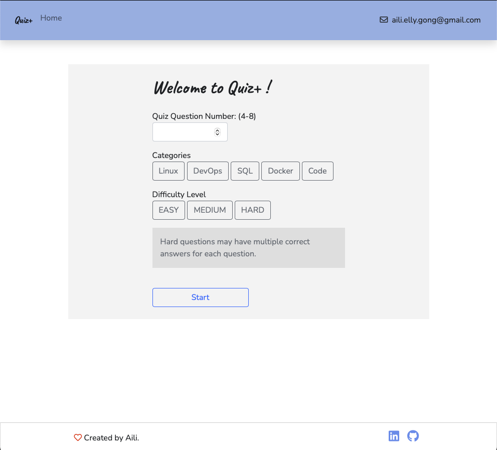

# README

A time limited uni project using Ruby on Rails.



### Heroku deployment URL

https://s3443647-quizapp.herokuapp.com


### Build with
- ruby '2.7.2'
- rails '6.1' 
- postgresql '1.1'

### Bundler Setup 
```bash
$ gem install bundler
$ bundle install
```

### Postgres Rails DB Setup 
```bash
$ rake db:setup
$ rake db:migrate
$ rake db:seed
```

### Run 

```bash
$ rails server
```

Access locally via http://127.0.0.3:3000